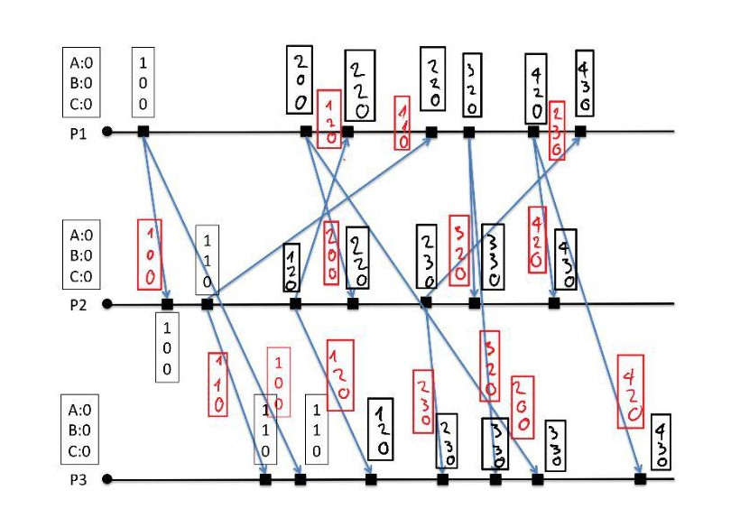

# Mini Test Answers
## Task 1
With vectorclocks we have the advantage, that we can't have two events with the same timestamp.
This is the case because Lamport timestamps are only partially ordered.
Furthermore Vectorclocks capture the causal relations and Lamport timestamps don't.
## Task 2
- For all Processes the Clock1 <= Clock2
- For at least one process Clock1 < Clock2
## Task 3
The clock tick happens before the sending of a messsage, such that the receiving processor gets the incremented timestamp of the sending process.
If we would make the clock tick after sending the message, the receiving process would get an old timestamp which hasn't yet been incremented.
## Task 4

## Task 5
